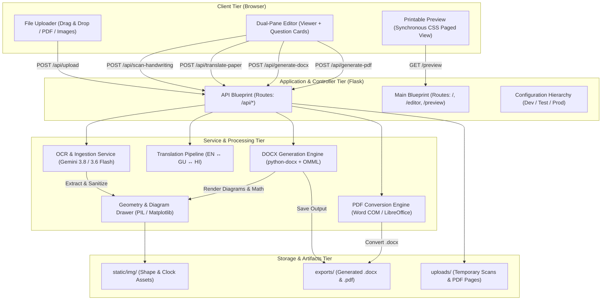
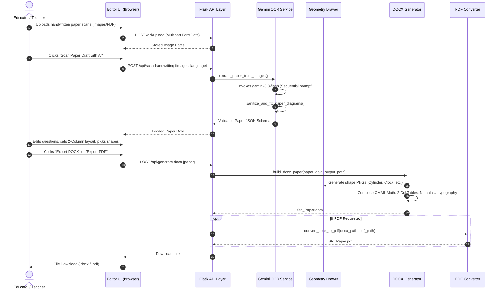

# ExamPaperAI – System Architecture & Technical Specifications

This document outlines the architectural blueprint, component design, data flow pipelines, integration interfaces, and technical decisions behind **ExamPaperAI** — an enterprise-grade AI-powered multilingual examination paper digitizer, workspace editor, and document generation system.

---

## 1. High-Level Architecture Overview

ExamPaperAI follows a decoupled, modular layered architecture combining a reactive client-side editing workspace with a Python Flask service orchestration backend, Google Gemini multimodal AI models, and dual document compilation engines (DOCX & PDF).



---

## 2. Layered Component Breakdown

### 2.1. Presentation / Client Tier
- **Dual-Pane Split Workspace (`editor.html` & `editor.js`)**:
  - **Left Pane (`viewer.js`)**: High-performance pan-and-zoom viewer utilizing HTML5 Canvas/DOM transformations for inspecting high-resolution handwritten drafts.
  - **Right Pane**: Reactive structured question form with inline live math rendering (fractions, powers, roots), diagram preview cards, sub-question layout switches, and section management.
- **Synchronous Printable Preview (`preview.html`)**:
  - Emulates physical A4 page layout with CSS Paged Media rules (`@page`, `@media print`).
  - Mirrors exact formatting rules (2-column grids, horizontal option columns, vertical answer lines, geometric shape icons) identically to the DOCX engine.
- **Design Tokens (`static/css/tokens.css` & `main.css`)**:
  - HSL-based curated color palette (`--primary-600: #4f46e5`, `--slate-900: #0f172a`).
  - Strict 4px/8px modular spacing and elevation shadow tokens.

### 2.2. Web & Controller Tier (Flask)
- **`app/routes/main.py`**:
  - Serves base HTML views (`/`, `/editor`, `/preview`).
- **`app/routes/api.py`**:
  - Handles asynchronous REST operations:
    - `/api/upload`: Multi-image and multi-page PDF ingestion.
    - `/api/scan-handwriting`: Gemini Vision OCR extraction.
    - `/api/translate-paper`: Preserving-mode language translation.
    - `/api/generate-docx`: Document compilation endpoint.
    - `/api/generate-pdf`: PDF conversion endpoint.
    - `/api/set-gemini-key` & `/api/config-status`: Key management.

### 2.3. Service & Business Logic Tier

#### A. OCR & Transcription Service (`app/services/ocr_service.py`)
- **Engine**: Google GenAI SDK (`google-genai` / `google-generativeai`).
- **Model Hierarchy**: Prioritizes `gemini-3.8-flash` $\rightarrow$ `gemini-3.6-flash` $\rightarrow$ `gemini-3.7-flash` $\rightarrow$ `gemini-flash-latest`.
- **Schema Normalization**:
  - Enforces strict JSON extraction containing metadata, section headers, right-aligned marks, question types, and diagram types.
- **Auto-Healing Pipeline (`sanitize_and_fix_paper_diagrams`)**:
  - Reconciles missing section marks from sub-question counts (preventing understated total marks).
  - Detects text placeholders (e.g., `[Cylinder shape]`, `[Draw hands to show time]`) and promotes them into native diagram directives.
  - Strips legacy `Ans:` prefixes and normalizes question text.

#### B. Diagram & Geometry Generator (`app/services/geometry_drawer.py`)
- **Clean 2D/3D Shapes**: Algorithmic vector drawing for `cylinder`, `pyramid`, `sphere`, `circle`, `cone`, and `cube` with clean dashed back-edges and anti-aliased rendering.
- **Analog Clock Faces**: Generates both blank clock dials (for student hand-drawing) and clocks with specified hour/minute hands.
- **Polyline & Line Geometry**: Generates zigzag transversals (`L-M-P-Q-R`) and ray intersections with labeled points.
- **Charts & Pictographs**: Renders custom tabular charts and pictographs.

#### C. DOCX Generation Engine (`app/services/docx_generator.py`)
- **Typography & Font Fallbacks**:
  - Standardizes on `Nirmala UI` across all paragraph and run levels, guaranteeing flawless rendering for English, Gujarati (ગુજરાતી), and Hindi (हिन्दी) Indic ligatures.
- **Office Math Markup Language (OMML)**:
  - Embeds native mathematical fractional expressions (`<m:f>`, `<m:num>`, `<m:den>`) directly into paragraphs rather than relying on plain slash text.
- **Adaptive Layout Engines**:
  - **2-Column Side-by-Side (`two_columns`)**: Borderless balanced grid for sub-questions and MCQ options.
  - **1-Row Horizontal (`horizontal`)**: Equal-width columns across the document text boundary.
  - **Vertical (Stacked)**: Standard top-to-bottom layout with proportional answer line spacing.
- **Header & Assessment Block**:
  - Dynamic grouping of sections (`Q-1`, `Q-2`, `Q-3`) with real-time sum validation against paper target marks.

#### D. PDF Conversion Service (`app/services/pdf_generator.py`)
- **Primary Engine (Windows)**: Microsoft Word COM Automation (`win32com.client`) with explicit COM process termination and resource cleanup.
- **Cross-Platform Fallback**: Headless LibreOffice (`soffice --headless --convert-to pdf`).

---

## 3. End-to-End Data Pipeline



---

## 4. Standardized Paper JSON Schema

```json
{
  "metadata": {
    "exam_title": "1st Semester Examination – 2026",
    "standard": "Std. 6th",
    "subject": "Mathematics",
    "total_marks": "60",
    "time_limit": "2 Hours"
  },
  "sections": [
    {
      "id": "sec_3c",
      "title": "Q-3(C) Name the following Shapes",
      "marks": "[3]",
      "type": "general",
      "subquestions_layout": "two_columns",
      "questions": [
        {
          "text": "(1) = ____________________",
          "diagram_type": "cylinder",
          "is_bold": true
        },
        {
          "text": "(2) = ____________________",
          "diagram_type": "pyramid",
          "is_bold": true
        },
        {
          "text": "(3) = ____________________",
          "diagram_type": "sphere",
          "is_bold": true
        }
      ]
    }
  ]
}
```

---

## 5. Architectural Quality Attributes & Hardening

1. **Indic Script Integrity**:
   - Every text run generated in DOCX explicitly sets `Nirmala UI` across standard, complex script, and high-ANSI font definitions (`w:ascii`, `w:hAnsi`, `w:cs`).
2. **Page Budget Balancing & Anti-Spill**:
   - Typographic margins (`Pt(6)` after questions, `Pt(4)` before questions, `Pt(12)` before section headings) prevent trailing single-question spillover onto redundant pages.
3. **Fail-Safe Diagram Rendering**:
   - Pre-generated static fallback assets (`static/img/shape_*.png`, `static/img/clock_blank.png`) ensure documents compile cleanly even if runtime image generation encounters an environment restriction.
4. **Security & Input Sanitization**:
   - All uploaded file paths are sanitized via `secure_filename()`.
   - Temporary COM objects are guaranteed termination via `pythoncom.CoInitialize()` and `pythoncom.CoUninitialize()` in structured `try...finally` blocks.
